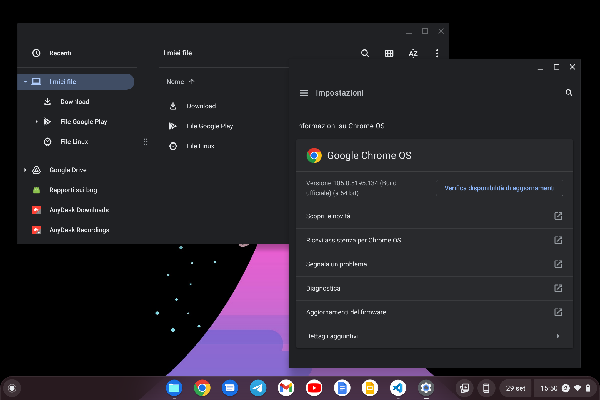
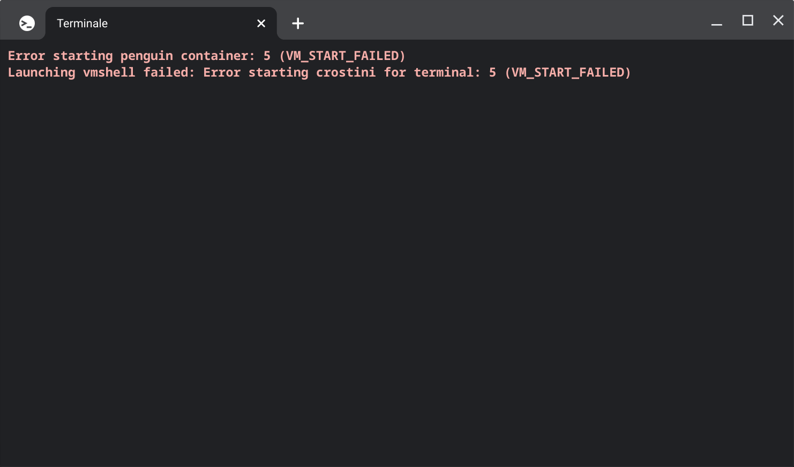

# ChromeOS: a review by a Windows (and occasional Linux) user
For a couple of months now I've been using ChromeOS on my Huawei Matebook 14 and there are a lot of things I have to say.

## Installation
Normally, ChromeOS is available only on Chromebooks, laptops that are approved by Google and developed with ChromeOS in mind, but of course I still don't want to buy a Chromebook, so I decided to install it on my laptop. How? With a project called [Brunch](https://github.com/sebanc/brunch), it aims to install the same ChromeOS that is installed on Chromebooks, but on other x86 computers. Yes, I know that now ChromeOS Flex exists, but it has a lot of limitations, for example it doesn't support Android apps (I will talk about those in a bit), and it's also an operating system that still has only a Dev-Unstable release, which is not a very good thing.

## User Interface
I have to say it, the UI is really good, both aesthetically and functionally. The desktop actually doesn't exist (well, it is present but it doesn't have nothing), everything you have is a taskbar in the bottom, called "shelf" with a drawer button, pinned and opened apps, a calendar and a control center.  
In ChromeOS "material design" is the key word, everything starting from Chrome, to the File Manager, and even Settings follow the latest material design (well, it doesn't have material you but it's fine). Also, dark mode is now available and works with every application available except for Linux apps.

## Applications
Actually a lot of years passed and app compatibility increased a lot, also because of the two features I'll introduce a bit later, but first…

### …Web apps
ChromeOS is an operating system based around the web experience, so it’s not a surprise that the applications you are probably going to use the most are web apps, now ~80% of the software has a web version that at least works, so it makes sense using it when the application that runs the best is your web browser.

### Android apps
Here’s the first feature I was talking about, a few years ago Google introduced the Android Subsystem for ChromeOS that allows you to run the Play Store and basically every Android application, it can come handy when the app doesn’t have a good web version or can’t be just ported as a web app, for example there are a lot of games and some good video editors that aren’t available as a web page, but that can be installed anyways on an Android device. In terms of performance it runs pretty much as a native application because there is no emulation, everything is just in a container.

### Linux apps
This is one of the newest features and… it could be better. Basically, Google developed Crostini which is basically a Debian VM that allows you to run Linux applications. The fact that it is virtualized is obvious, applications run slower than usual and it is unreliable a lot of times, for example it can just stop working at any time without doing anything.

## Ecosystem
Did you know that Google has an ecosystem? Well, you probably knew that but let’s ask because why not? I actually use Google’s ecosystem and ChromeOS has a lot of features of it (of course I’d say). For example:

### Phone Hub
Having phone integration can be really useful and I think that Phone Hub it’s one of the best out there. You can do things like ringing your phone, put it in silent mode and connect instantly to your phone’s internet connection without having to enable the hotspot by yourself.

### Nearby Share
Do you know AirDrop? That thing that people use to share photos to unknown people in the area? Well, Google has recently made a knockoff of this too. You can’t share things with random dudes because by default it’s only visible by contacts, but it’s still useful. For example I usually want to share a file or a string of text to my computer, I use SendAnywhere by a long time but it’s not really effective, well it works and that’s what is important, but having to open the program, receive the file and optionally copying it to the clipboard can be pretty annoying. Nearby Share does that more efficiently, yeah it isn't as effective as AirDrop, but it works really well too.

### Google Drive in the File Manager
And let’s not forget that ChromeOS natively has a Google Drive client that is actually good, as well as being pre-installed and already running without a boring setup that Google Drive for Desktop has.

## Trying to do something
Now that I have talked a bit about ChromeOS, let’s try to use it. I’m gonna list the things I do on a daily basis (maybe a bit more) and tell you how’s going.

### Browsing the web and using essential apps
Well, as I said before, ChromeOS is based around the web experience so, as you may have guessed, it works really well.

### Programming
Yes, ChromeOS can actually be used for programming and does it really well, you can choose to use an IDE on Crostini or, as I did, using a web IDE. My IDE of choice is always VSCode and it actually has a web version that basically works as its desktop counterpart, and it’s very pleasant to use. But I really miss the debug execution thing, it is very handy.

### Gaming
You obviously can’t run AAA games and you can’t even expect to run a very complicated desktop game without encountering problems, but you can install very good Android games from the Play Store and and no one forbids you to run browser games. While you can’t run a lot of desktop games let’s be honest, who would not like to have [Flying Gorilla](https://play.google.com/store/apps/details?id=jp.pinbit.flygorilla) on their computer?

## Problems
Of course with any operating system I try I always have a lot of issues, these are the two that I found:
- **Hardware compatibility:** it’s not really a ChromeOS issue because it was meant to run on Chromebooks only, but it’s undeniable that on a lot of hardware it can have problems, for example on my Matebook the sound card doesn’t work so I need to connect my computer via HDMI or connect a headphone/speaker via USB or Bluetooth. Also, NVIDIA cards do not work so, you need to have at least a compatible GPU like the integrated one.
- **Application compatibility:** while it is true that you can also run Android and Linux apps, you will still miss some programs like the Adobe suite or just a good, complex and very complete video editor.

## Conclusion
It certainly has some problems, but it’s in constant improvement and, considering the stuff that Google made in the last two years, I think that in the foreseeable future it can be an operating system that at least 80% of people can use.
