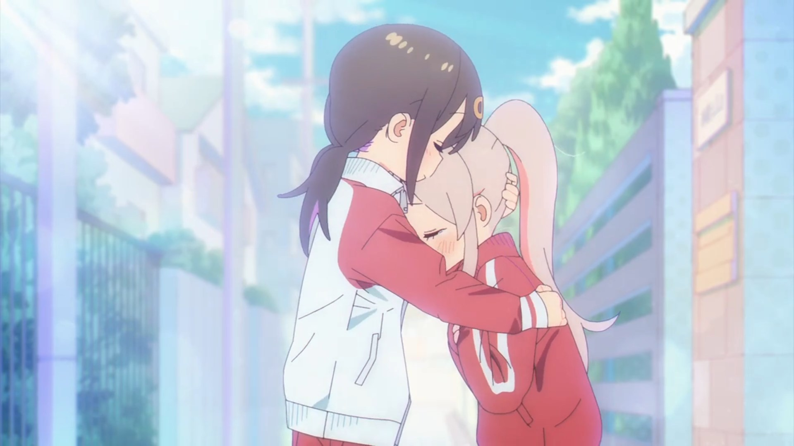

# ONIMAI: it's not that bad as you might think
Welcome back, it's by a lot of time that I don't write a blog post. First of all, happy new year (a bit late but hey, that's how it works). This post is unfortunately not tech-related but I also want to write one of those in some weeks, so stay tuned. 
I've lately began to get into CGDCT animes in the last weeks and the fault is mainly K-ON's (that I'm still watching and I hope that I'll finish it). At the end I decided to begin with "ONIMAI: I'm Now Your Sister" (or "Onii-chan wa Oshimai!"), based on the Nekotofu's manga of the same name (I don't read mangas, because I hate reading, so I can't speak about its quality), because a video that I saw inspired me to watch it.  

## Why am I talking about this and why is it actually good?
Premise made, the first impressions of this anime were pretty mid, it's about Mahiro, an hikikomori that plays erotic games, waking up as a middle school girl after his sister, Mihari, tried out one of her experiments on him (or I guess now her), so Mahiro has to adapt herself to the life of a woman and let me tell you, things will get weirder. If you think it's fanservice, it's probably because it seems like it, even myself wouldn't have watched it if I haven't saw the video, but don't judge by its cover, it's more than just that.  
First of all it is directed by Studio Bind, it doesn't seem that important, but I'm glad about that because it's probably one of the few studios that could make this adaptation actually nice. It also has a good story behind it: Begins with Mahiro discovering that she became a girl, Mihari trying to get her back to a normal life, Mihari starting to know other people and so on. And my favorite part as a guy who loves cute things, there are a lot of wholesome and cute scenes: for example the one of episode 1 where Mihari hugs Mahiro after she begs her to run besides her (sorry for the repetition, I couldn't write it better), or the one of episode 3 where Mahiro struggles to present herself to Kaede, and I could keep going (still don't want to spoiler much to you). Another aspect that could be liked is that the color scheme looks very warm, which makes this anime's look more unique + the animators really wanted to express the character's emotions (especially with spiral eyes, I guess they really liked those because I saw them pretty often).  
Btw, did you now that I never finished a TV series until now? Yeah I don't really know the reason but there was always a point where I paused the series and never picked it up again and that's the main reason I have dropped Death Note. ONIMAI is actually the first one that I finished and, yet more impressive, I did it in just 4 days. I really enjoyed the show and it even moved me. I was pretty sad when I reached the end.  
Also, a bit off-topic from my difficulty to complete a show or my sadness, Asahi is my second favourite character after Mahiro, she's a very cute girl.

## Conclusion
In conclusion, I think that ONIMAI deserves to be watched if you can stand the ecchi parts and you're away from parents, workplace etc. If you have watched it, please tell us about your opinion and experience (just remember to mark spoilers as, you know, spoilers and be respectful with others). Let's see you in the next article where I will talk about tech, I hope.  
