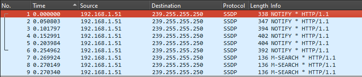
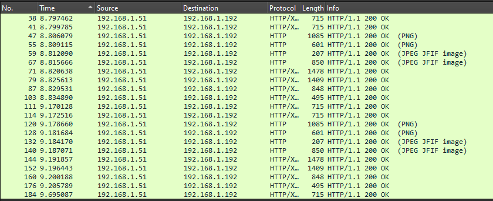
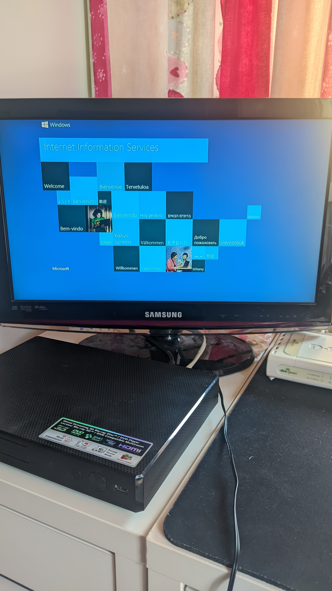
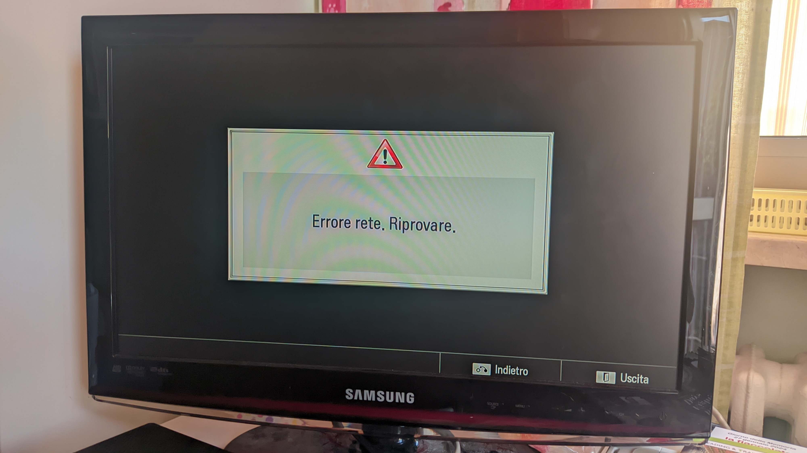

# Trying to jailbreak an old LG Bluray Player
Hello there, I don't know where to begin: I have an old LG Blu-ray Player laying around, it's the BP450 model to be exact and it has an ethernet port. Why you may ask? It's because there's a service called Premium on it that allows you to stream content online, I'd really love to see some type of third party applications on this but unfortunately only YouTube and Netflix are on the list, so how can I hack this?
## Pretending to know how the machine works
I've never done reverse engineering before and I don't even know if I should consider this "reverse engineering", I'm not really practical with the process and I'm trying my best to understand how this thing works. My main theory is that the player loads some HTTP page on a public domain, and then with a local DNS server we can change that page to anything we want, seems simple enough.  
I decided to hook the player on my LAN and open WireShark (a network packet monitoring tool). It took a few tries but I started to find some stuff.  
  
Upon starting the Premium functionality the player seems to start trying to connect to a certain IP address, I've tried to open it on my computer but, nothing. With a Google search it seems to be a reserved IP for some local stuff. Trying to start YouTube seems to not change anything.  
While I was thinkering with what I had I tried to start the capture before starting the connection wizard, fairly enough there are some HTTP requests:

They all seem to be requests to a web server installed on the player located on port 2870, trying to open the page in a browser results in a "403 Forbidden" error, its user agent seems to go by the name of "LG-BDP Linux/2.6.35 UPnP/1.0 DLNADOC/1.50 LGE_DLNA_SDK/1.5.0".
Other than this stuff I haven't found anything interesting that I could see, so I tried to do the DNS trick without knowing any better and probably this whole WireShark thing I did was useless.
## Trying to hijack the WebView
If the apps are on a WebView as I think, then this is going to be very easy, however, because this is a Blu-ray Player these could always be Java apps, if this is the case then I don't know why Netflix and YouTube are still supporting these versions, because in 2024 I don't think anybody would use these on a Blu-ray Player so it's not in their interest, especially for Google who kills services that are not used enough.  
Meanwhile let's try to use the "classic methods", I hooked up the player to my Pi-hole DNS server and the query log seems to show me pings to `www.lge.com` (wow, I don't know how to use Wireshark and for what purpose it was meant for), I can't unfortunately see the entire address the player is searching for but while I was trying just for science to change the DNS name to the reverse proxy I have installed on my server I see another domain to the query log, `it.lgtvsdp.com`, opening it on a normal browser seems to redirect to the LG Content Store that LG TVs now use, so it seems very related, it even appeared again when I opened the Premium function, so I tried to create a custom DNS entry for that domain on my Pi-hole and when I opened Premium again... nothing happened, the screen show the usual Netflix and YouTube apps and opening YouTube works as always, I even tried to restart the player but nothing.  
Upon opening YouTube I see on the query log that the player pings `www.youtube.com`, maybe I should change that, it also makes sense because YouTube has a web page for the TV version, so I'm finally trying to add a DNS record for the YouTube domain and...  
It still goes on YouTube... WHY? This shouldn't work after I literally changed the domain's IP, then I tried to connect to the DNS server on my computer and youtube.com was still working as normal, I switched to a browser that I don't use often and saw why it didn't work...  

## Fucking with SSL
I'll have to find a way to make HTTPS work on youtube.com, even if I'm not the real owner of the domain, I have also found that I was using the wrong DNS name (the player goes to the www subdomain instead of root), I fixed it and now the YouTube app stopped working entirely, leaving me with an infinite loading screen.  
I still need to find a way to make HTTPS work, so I tried to make a self-signed certificate, it often requires to add it manually on the client which I can't probably do here, but I hope that the player is stupid enough to let us enter anyways. I took way too much time to setup the certificate, and while my browsers refuse to open it, the player loads the page without asking anything, `https://youtube.com/tv` to be exact.  

## Conclusion and future plans
The latest LG blu-ray players, and probably many others, are now officially hacked but there's still a lot of progress to do and that I don't really have the time and skills to thinker with at the moment. To pull this off I needed to have a DNS server, a reverse proxy, a self-signed SSL certificate and a bit of technical knowledge, and I didn't even get control of it, there's no type of cursor even if you put `<a>` elements and even with redirects I am very limited, I tried to connect to my Jellyfin server with both the local address and the public webpage, and both didn't work, the public page even gave me a cryptic error.  
  
But this is still a great opportunity for homebrew developers, it's a web browser after all and even if it might not support every HTML5 feature it's still good, maybe someday we'll see DOOM running on it.